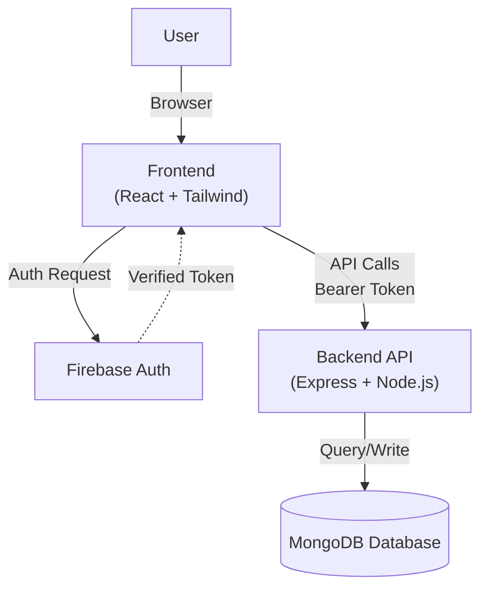

# 📚 0xShelf

A premium, full-stack MERN application for modern bookstore management. Designed with elegance and built for scale, 0xShelf offers a seamless experience for both readers and administrators.

[](https://opensource.org/licenses/MIT)
[](https://reactjs.org/)
[](https://nodejs.org/)
[](https://www.mongodb.com/)
[](https://tailwindcss.com/)

---

## ✨ Features

- 🔐 **Secure Authentication**: Robust signup and login using **JWT** and **Firebase Auth**.
- 📖 **Smart Inventory**: Effortless book browsing, searching, and real-time availability.
- 🛒 **Streamlined Orders**: Integrated order management system for a smooth checkout.
- 📊 **Admin Insights**: Comprehensive dashboard with sales statistics and inventory control.
- 📱 **Fluid UX**: Fully responsive design optimized for any device size.
- 🎨 **Modern Interface**: Crafted with React and Tailwind CSS for a professional look.

---

## 🏗️ Architecture



---

## 🛠️ Tech Stack

### Frontend

- **Framework**: [React](https://react.dev/) (Vite)
- **Styling**: [Tailwind CSS](https://tailwindcss.com/)
- **State Management**: [Redux Toolkit](https://redux-toolkit.js.org/)
- **Authentication**: [Firebase SDK](https://firebase.google.com/)
- **Icons & UI**: [Lucide React](https://lucide.dev/), [SweetAlert2](https://sweetalert2.github.io/), [Swiper](https://swiperjs.com/)

### Backend

- **Runtime**: [Node.js](https://nodejs.org/)
- **Framework**: [Express.js](https://expressjs.com/)
- **Database**: [MongoDB](https://www.mongodb.com/) (via Mongoose)
- **Security**: [JSON Web Tokens (JWT)](https://jwt.io/), [bcrypt](https://github.com/kelektiv/node.bcrypt.js)

---

## ⚙️ Quick Start

### 1. Clone & Enter

```bash
git clone https://github.com/MANOJ-80/0xShelf.git
cd 0xShelf
```

### 2. Backend Initialization

```bash
cd backend
npm install
cp .env.example .env  # Configure your PORT, DB_URL, and JWT_SECRET_KEY
npm run start:dev
```

### 3. Frontend Initialization

```bash
cd ../frontend
npm install
cp .env.example .env  # Configure your Firebase credentials
npm run dev
```

---

## 🔌 API Endpoints

| Route         | Method                | Description          |
| :------------ | :-------------------- | :------------------- |
| `/api/books`  | `GET/POST/PUT/DELETE` | Inventory Management |
| `/api/orders` | `GET/POST`            | Order Processing     |
| `/api/auth`   | `POST`                | User Lifecycle       |
| `/api/admin`  | `GET`                 | Dashboard Analytics  |

---

## 🤝 Contributing

Contributions make the open-source community an amazing place to learn, inspire, and create. Any contributions you make are **greatly appreciated**.

1. Fork the Project
2. Create your Feature Branch (`git checkout -b feature/AmazingFeature`)
3. Commit your Changes (`git commit -m 'Add some AmazingFeature'`)
4. Push to the Branch (`git push origin feature/AmazingFeature`)
5. Open a Pull Request

---

## 📄 License

Distributed under the MIT License. See `LICENSE` for more information.

Developed with ❤️ by [MANOJ-80](https://github.com/MANOJ-80)
